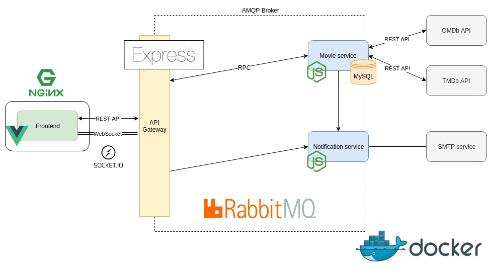

# Kiến trúc Hệ thống

## Tổng quan

Hệ thống đặt vé xem phim này được xây dựng dựa trên kiến trúc microservices. Mỗi dịch vụ (service) đảm nhiệm một phần chức năng cụ thể và có thể được triển khai, mở rộng một cách độc lập. Các dịch vụ giao tiếp với nhau chủ yếu thông qua API Gateway. Tính năng đặt giữ chỗ tạm thời được xử lý bằng Socket.io, và thông báo email được gửi đi khi đặt vé thành công.

Luồng hoạt động chính của hệ thống cho phép người dùng duyệt phim, xem chi tiết, chọn suất chiếu và ghế, sau đó tiến hành đặt vé. Hệ thống sẽ kiểm tra tính khả dụng của ghế, lưu thông tin đặt vé, cập nhật trạng thái ghế và gửi email xác nhận cho người dùng. API Gateway đóng vai trò trung tâm trong việc điều phối các yêu cầu và quản lý trạng thái đặt giữ chỗ tạm thời.

## Các Thành phần Hệ thống

-   **API Service (API Gateway)**: Điểm truy cập duy nhất cho client (frontend), điều hướng các yêu cầu HTTP đến các microservice backend phù hợp. Quản lý các kết nối WebSocket (Socket.io) cho việc đặt giữ chỗ tạm thời.
    *   *Công nghệ*: Node.js, Express.js, Socket.io
    *   *APIs*: RESTful endpoints cho các thao tác liên quan đến phim, đặt vé; WebSocket endpoints cho đặt giữ chỗ.
    *   *Vai trò chức năng*: Điều hướng yêu cầu, quản lý đặt giữ chỗ tạm thời, có thể thực hiện xác thực và tổng hợp phản hồi.

-   **Movie Service**: Quản lý thông tin phim, suất chiếu, sơ đồ ghế và xử lý logic đặt vé.
    *   *Công nghệ*: Node.js, Express.js, MySQL
    *   *APIs*: RESTful endpoints để cung cấp thông tin phim, suất chiếu, ghế và xử lý đặt vé.
    *   *Vai trò chức năng*: Cung cấp danh sách phim, chi tiết phim, quản lý suất chiếu, kiểm tra tính khả dụng của ghế, tạo và lưu trữ đơn đặt vé, cập nhật trạng thái ghế.

-   **Notifications Service**: Gửi email thông báo xác nhận đặt vé cho người dùng.
    *   *Công nghệ*: Node.js, Express.js, Dịch vụ SMTP (ví dụ: Ethereal)
    *   *APIs*: (Thường là internal) Endpoint để nhận yêu cầu gửi email từ Movie Service hoặc API Service.
    *   *Vai trò chức năng*: Soạn và gửi email xác nhận đặt vé thành công.

-   **Frontend Service**: Cung cấp giao diện người dùng cho việc duyệt phim, chọn vé và đặt vé.
    *   *Công nghệ*: Vue.js
    *   *Vai trò chức năng*: Hiển thị thông tin, thu thập thông tin đầu vào từ người dùng, tương tác với API Service.

-   **Cơ sở dữ liệu (Database)**: Mỗi microservice (Movie Service) có thể có cơ sở dữ liệu riêng để lưu trữ dữ liệu của mình (ví dụ: thông tin phim, đặt vé, trạng thái ghế). API Service có thể sử dụng Redis hoặc giải pháp lưu trữ trong bộ nhớ khác cho việc quản lý đặt giữ chỗ tạm thời nếu cần mở rộng.
    *   *Công nghệ*: MySQL

## Giao tiếp giữa các Thành phần

-   **Frontend và API Gateway**: Giao tiếp qua REST APIs (cho các yêu cầu thông thường) và WebSocket (cho tính năng đặt giữ chỗ tạm thời).
-   **API Gateway và Microservices (Movie Service, Notifications Service)**: API Gateway điều hướng các yêu cầu HTTP (thường là REST) đến các microservice tương ứng. Ví dụ, yêu cầu lấy danh sách phim sẽ được chuyển đến Movie Service.
-   **Movie Service và Notifications Service**: Khi một vé được đặt thành công trong Movie Service, nó có thể kích hoạt Notifications Service để gửi email. Việc này có thể được thực hiện thông qua một yêu cầu HTTP trực tiếp từ Movie Service đến Notifications Service, hoặc thông qua một message broker (như RabbitMQ, nếu `AMQP_URL` được sử dụng) để tăng tính tách biệt và khả năng phục hồi.
-   **Kết nối nội bộ (Docker Compose)**: Các dịch vụ chạy trong Docker container có thể giao tiếp với nhau qua tên dịch vụ được định nghĩa trong `docker-compose.yml`.

### Luồng Giao tiếp Chính (Đặt Vé)

1.  **Người dùng (Frontend)** gửi yêu cầu lấy danh sách phim đến **API Gateway**.
2.  **API Gateway** chuyển tiếp yêu cầu đến **Movie Service**.
3.  **Movie Service** trả về danh sách phim.
4.  **Người dùng (Frontend)** chọn phim, suất chiếu và ghế. Khi chọn ghế, một kết nối WebSocket được thiết lập với **API Gateway** để gửi thông tin ghế đang chọn.
5.  **API Gateway** (thông qua Socket.io) quản lý trạng thái "đang giữ tạm thời" của ghế, có thể giao tiếp với **Movie Service** để xác nhận tính hợp lệ.
6.  **Người dùng (Frontend)** xác nhận đặt vé, gửi yêu cầu POST đến **API Gateway**.
7.  **API Gateway** chuyển tiếp yêu cầu đặt vé đến **Movie Service**.
8.  **Movie Service** xử lý đặt vé, lưu vào cơ sở dữ liệu, cập nhật trạng thái ghế.
9.  **Movie Service** (hoặc **API Gateway**) thông báo cho **Notifications Service** để gửi email xác nhận.
10. **Notifications Service** gửi email cho người dùng.

## Sơ đồ Kiến trúc



```mermaid
graph TD
    User[Người dùng] -->|HTTP/WebSocket| Frontend(Frontend - Vue.js)
    Frontend -->|HTTP/WebSocket| APIGateway(API Gateway / API Service - Node.js, Express, Socket.io)
    APIGateway -->|HTTP REST| MovieService(Movie Service - Node.js, Express)
    MovieService -->|CRUD| MovieDB[(Database Phim/Đặt vé - MySQL)]
    APIGateway -->|HTTP REST (nếu cần)| NotificationService(Notifications Service - Node.js, Express)
    MovieService -->|HTTP REST / AMQP?| NotificationService
    NotificationService -->|SMTP| EmailServer[Máy chủ Email (Ethereal)]

    subgraph Docker Environment
        APIGateway
        MovieService
        NotificationService
        Frontend
        MovieDB
    end

    classDef service fill:#f9f,stroke:#333,stroke-width:2px;
    class APIGateway,MovieService,NotificationService,Frontend service;
```

*Chú thích: Sơ đồ trên là một biểu diễn đơn giản. `AMQP?` cho thấy khả năng sử dụng message queue giữa Movie Service và Notifications Service.*

## Khả năng Mở rộng & Khả năng chịu lỗi

-   **Khả năng mở rộng (Scalability)**:
    *   Mỗi microservice (API Gateway, Movie Service, Notifications Service, Frontend) có thể được nhân bản (scale out) một cách độc lập dựa trên tải của từng dịch vụ.
    *   Docker Compose và một orchestrator như Kubernetes (trong môi trường production) có thể được sử dụng để quản lý việc nhân bản các container.
    *   Cơ sở dữ liệu có thể được mở rộng bằng các kỹ thuật như sharding, replication tùy thuộc vào loại CSDL được chọn.
    *   Đối với đặt giữ chỗ tạm thời qua Socket.io, nếu API Gateway được nhân bản, cần có giải pháp để chia sẻ trạng thái giữa các instance (ví dụ: sử dụng Redis adapter cho Socket.io).

-   **Khả năng chịu lỗi (Fault Tolerance)**:
    *   Việc chia nhỏ thành microservices giúp cô lập lỗi. Nếu một service gặp sự cố (ví dụ: Notifications Service), các chức năng cốt lõi khác (như duyệt phim, đặt vé trong Movie Service) vẫn có thể hoạt động (mặc dù email có thể không được gửi ngay lập tức).
    *   Sử dụng các cơ chế như retry, circuit breaker trong giao tiếp giữa các service có thể cải thiện khả năng phục hồi.
    *   Nếu sử dụng message queue (ví dụ: RabbitMQ cho AMQP_URL) giữa Movie Service và Notifications Service, tin nhắn yêu cầu gửi email sẽ được lưu lại và xử lý khi Notifications Service hoạt động trở lại, đảm bảo không mất thông báo.
    *   Health checks cho từng service giúp hệ thống giám sát và tự động khởi động lại các service bị lỗi.
